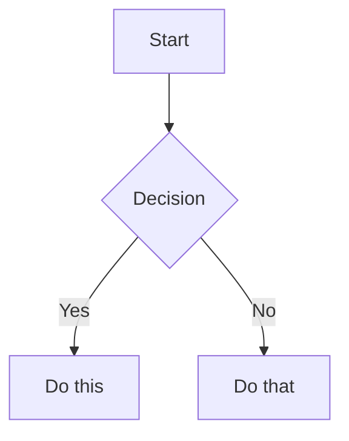

# Obsidian Flavored Markdown — 语法参考

来源：[Obsidian Help](https://help.obsidian.md/obsidian-flavored-markdown) + [kepano/obsidian-skills](https://github.com/kepano/obsidian-skills)

## Wikilinks

```markdown
[[Note Name]]                          链接到笔记
[[Note Name|Display Text]]             自定义显示文字
[[Note Name#Heading]]                  链接到标题
[[Note Name#^block-id]]                链接到块
[[#Heading in same note]]              同一笔记内标题链接
```

定义块 ID（在段落后追加）：

```markdown
This paragraph can be linked to. ^my-block-id
```

列表和引用块的块 ID 放在单独一行：

```markdown
> A quote block

^quote-id
```

## Embeds

前缀 `!` 嵌入 wikilink 的内容：

```markdown
![[Note Name]]                         嵌入完整笔记
![[Note Name#Heading]]                 嵌入章节
![[image.png]]                         嵌入图片
![[image.png|300]]                     嵌入图片（宽度300px）
![[image.png|640x480]]                嵌入图片（宽x高）
![[document.pdf#page=3]]               嵌入 PDF 第3页
![[audio.mp3]]                         嵌入音频
![[video.mp4]]                         嵌入视频
```

## Callouts

```markdown
> [!note] 基本提示
> 内容

> [!tip] 自定义标题
> 带标题的提示

> [!warning]- 默认折叠
> 可折叠的提示（- 折叠，+ 展开）

> [!question] Outer
> > [!note] Inner
> > 嵌套提示
```

**支持的类型：**

| 类型 | 别名 | 颜色 |
|------|------|------|
| `note` | — | 蓝色 |
| `abstract` | `summary`, `tldr` | 青色 |
| `info` | — | 蓝色 |
| `todo` | — | 蓝色 |
| `tip` | `hint`, `important` | 青色 |
| `success` | `check`, `done` | 绿色 |
| `question` | `help`, `faq` | 黄色 |
| `warning` | `caution`, `attention` | 橙色 |
| `failure` | `fail`, `missing` | 红色 |
| `danger` | `error` | 红色 |
| `bug` | — | 红色 |
| `example` | — | 紫色 |
| `quote` | `cite` | 灰色 |

## Tags

```markdown
#tag                    行内标签
#nested/tag             嵌套标签（层级）
```

规则：字母（任何语言）、数字（不能开头）、下划线 `_`、连字符 `-`、斜杠 `/`。

## Comments

```markdown
This is visible %%but this is hidden%% text.

%%
This entire block is hidden in reading view.
%%
```

## Highlight

```markdown
==Highlighted text==                   高亮语法
```

## Math (LaTeX)

```markdown
行内: $e^{i\pi} + 1 = 0$

块级:
$$
\frac{a}{b} = c
$$
```

## Diagrams (Mermaid)

````markdown

````

## Footnotes

```markdown
Text with a footnote[^1].

[^1]: Footnote content.

Inline footnote.^[This is inline.]
```
