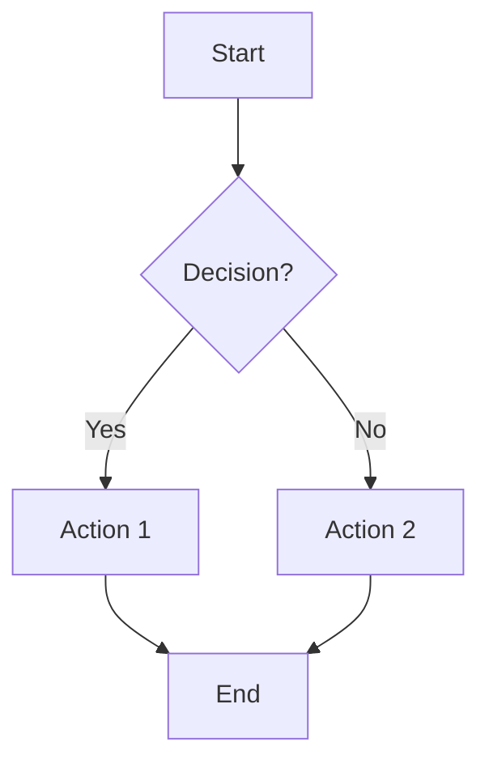
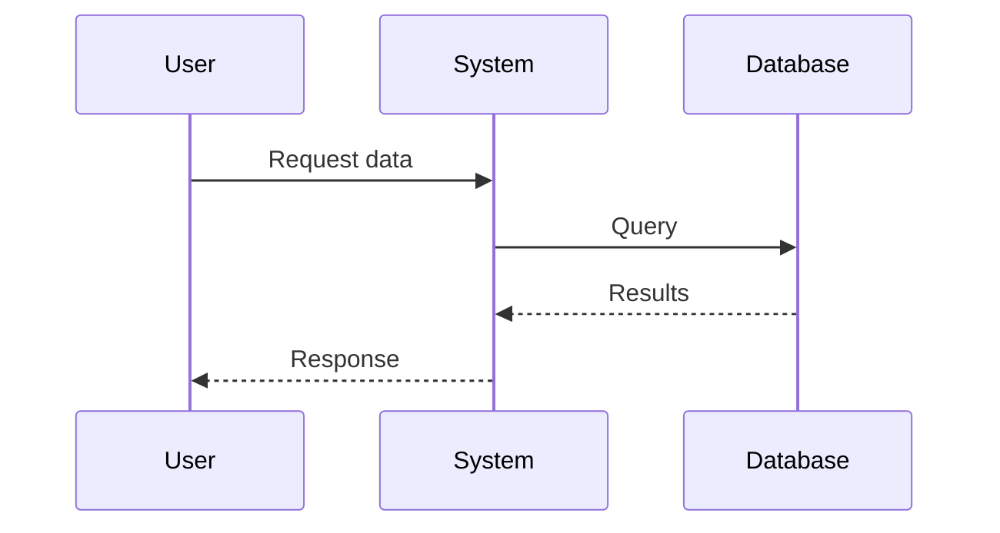
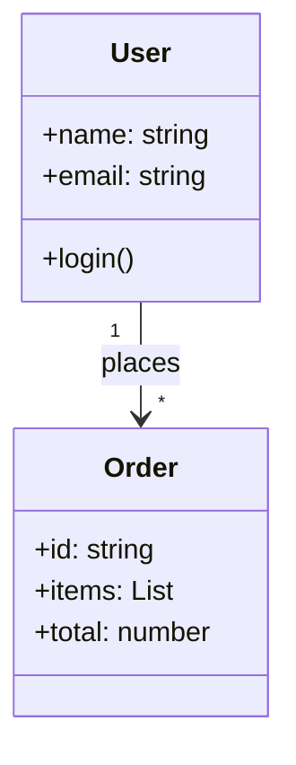
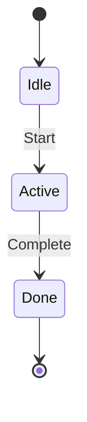
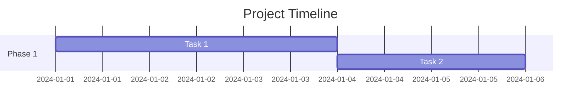
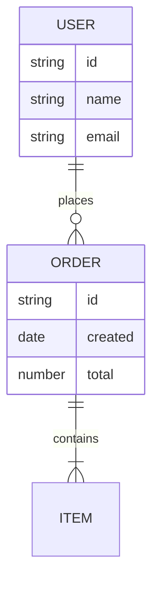

# Mermaid Usage Rules

When to use Mermaid diagrams and which types to choose.

## When to Use Mermaid

### ✅ Use Mermaid When:

1. **Processes/Workflows**: Step-by-step sequences
   - Example: "如何从0搭建系统"

2. **Relationships/Dependencies**: How things connect
   - Example: "系统架构示意图"

3. **Hierarchies/Trees**: Parent-child relationships
   - Example: "公司组织架构"

4. **Cycles/Loops**: Recurring processes
   - Example: "PDCA循环"

5. **Comparisons with Flow**: Decision trees, A/B choices
   - Example: "如何选择技术方案"

### ❌ Don't Use Mermaid When:

1. Simple lists (use HTML `<ul>`)
2. Pure text comparisons (use HTML `<table>`)
3. Single concepts (no flow needed)
4. Already visual content (images)

## Mermaid Types and Use Cases

### 1. Flowchart (flowchart TD/TB/LR/RD)

**Best For**:
- Linear processes
- Decision trees
- Simple workflows

**Example**:


### 2. Sequence Diagram (sequenceDiagram)

**Best For**:
- User-system interactions
- API call sequences
- Multi-agent workflows

**Example**:


### 3. Class Diagram (classDiagram)

**Best For**:
- System architecture
- Object relationships
- Module dependencies

**Example**:


### 4. State Diagram (stateDiagram-v2)

**Best For**:
- State transitions
- Workflow states
- Lifecycle diagrams

**Example**:


### 5. Gantt Chart (gantt)

**Best For**:
- Project timelines
- Milestone planning
- Schedule visualization

**Example**:


### 6. Entity Relationship (erDiagram)

**Best For**:
- Database schema
- Data relationships
- Entity mappings

**Example**:


## TemplateMermaid Selection Matrix

| Content Type | Recommended Mermaid | Why |
|--------------|---------------------|-----|
| Process workflow | `flowchart TD` | Clear step sequence |
| Multi-step decisions | `flowchart TD` | Decision tree |
| API interactions | `sequenceDiagram` | Request/response flow |
| System architecture | `classDiagram` | Module relationships |
| State machine | `stateDiagram-v2` | State transitions |
| Project timeline | `gantt` | Milestone visualization |
| Database schema | `erDiagram` | Entity relationships |

## Mermaid in HTML

When embedding Mermaid in HTML:

1. Wrap in `<div class="mermaid">...</div>`
2. Include Mermaid CDN in HTML head
3. Call `mermaid.initialize()` on page load

```html
<div class="mermaid">
flowchart TD
    A[Start] --> B[Process]
    B --> C[End]
</div>

<script src="https://cdn.jsdelivr.net/npm/mermaid@10/dist/mermaid.min.js"></script>
<script>
    mermaid.initialize({ startOnLoad: true });
</script>
```

## Quality Rules

1. **Keep it simple**: Don't over-complicate diagrams
2. **Use clear labels**: Text should be readable
3. **Consistent style**: Same color scheme across all diagrams
4. **Scalable**: Work at different zoom levels
5. **Alternative text**: Include text summary if diagram is complex

## Anti-Slop Rules

1. **No decorative Mermaid**: Only if it adds clarity
2. **No over-engineering**: Simple is better
3. **No complex syntax**: Use basic features mostly
4. **No duplicate info**: Don't repeat text in diagram
5. **No too-many-diagrams**: 1-2 per page max
